O desafio consiste em criar uma aplicação que gerencie os treinos de uma academia.

## Instruções para rodar o sistema
---
## Subindo o Docker para rodar o app
1. **sudo docker-compose build app**
2. **sudo docker-compose up -d**
3. 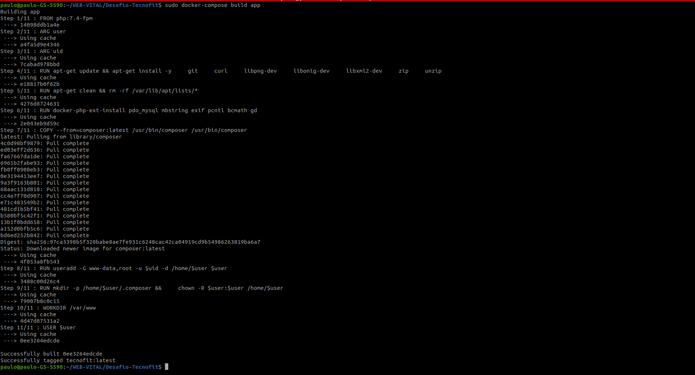

---
## Instalar as dependências do composer
4. **sudo docker-compose exec app composer install**
4.0.  

## atualizando as dependêbcuas
4.1. **sudo docker-compose exec app composer update**

---

## crie uma chave para o artisan
5. **sudo docker-compose exec app php artisan key:generate**
5.1. 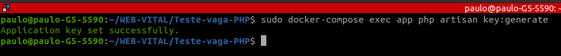 

---

## Verifique o host do mysql que o Docker gerou

Comando no terminal:

6.0. **docker ps**

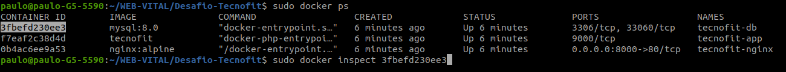

6.1. **docker inspect _id do mysql_**

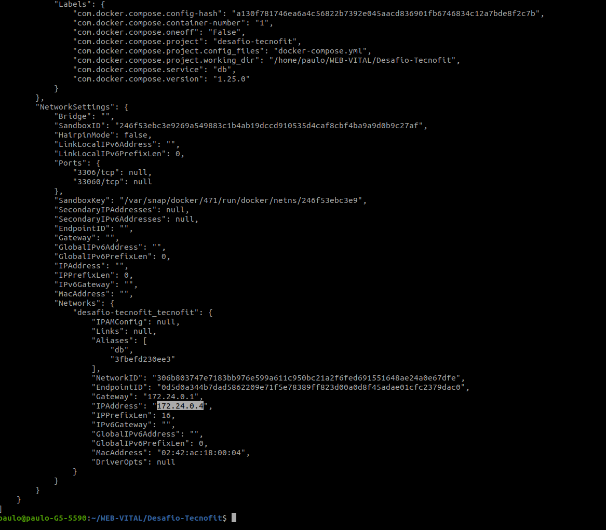

6.3. Copie o numero do IPAddress 
* Ex:  _172.24.0.4_
---

## Edit o host do mysql
7. **Abra o arquivo database.php linha 49 e coloque o host que o docker gerou**

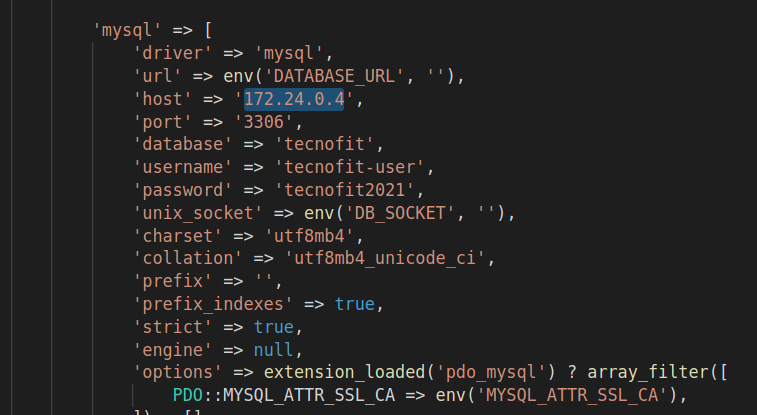

---

7.1. **sudo docker-compose exec app php artisan migrate**

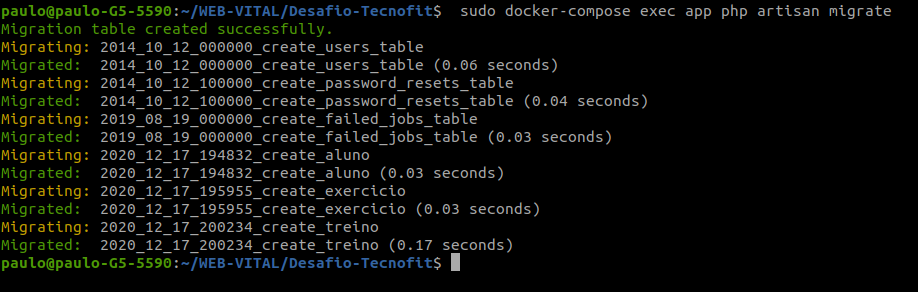

---

8. Acesse o **_http://localhost:8000/_**

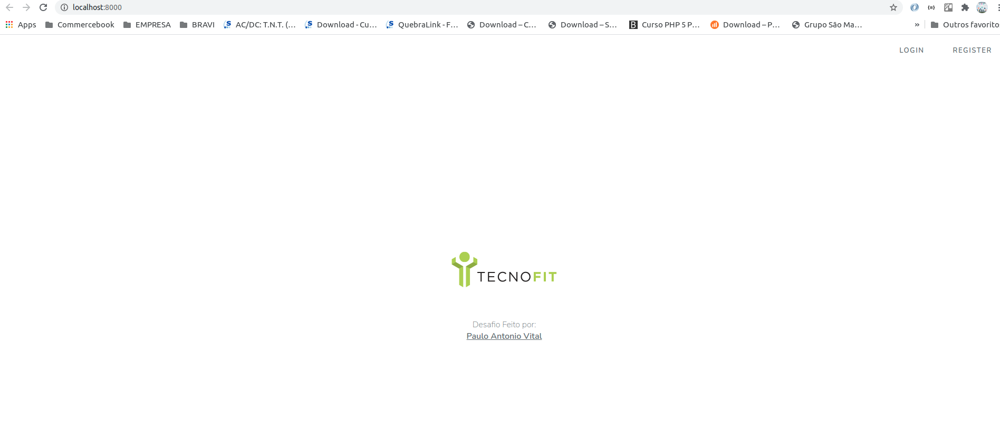

---
9. Crie seu usuario e realize o login
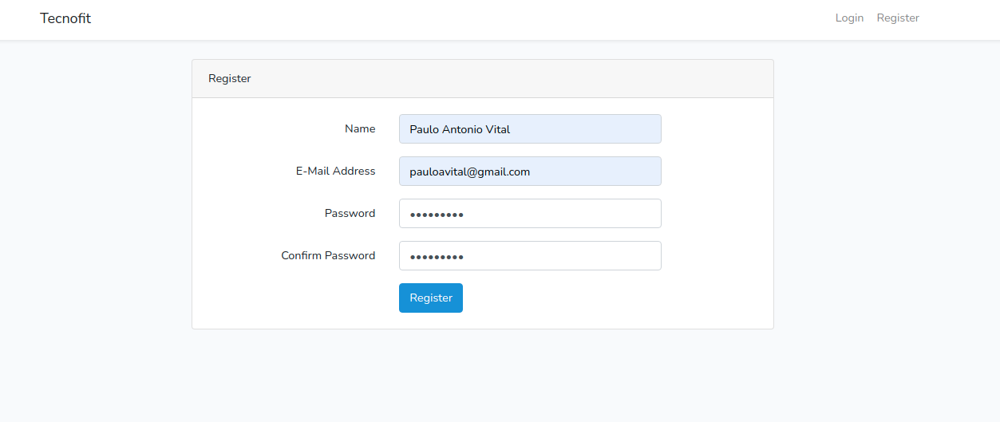

---

10. Na home verá os seguintes módulos:
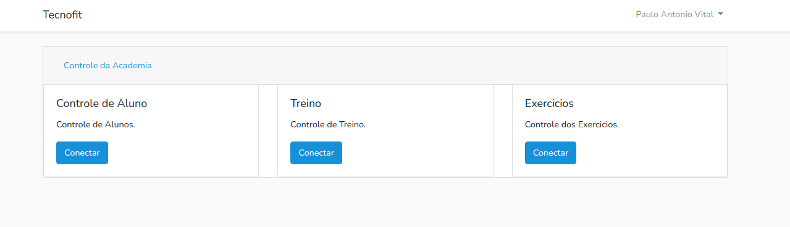

---

11. Cadastre os alunos:
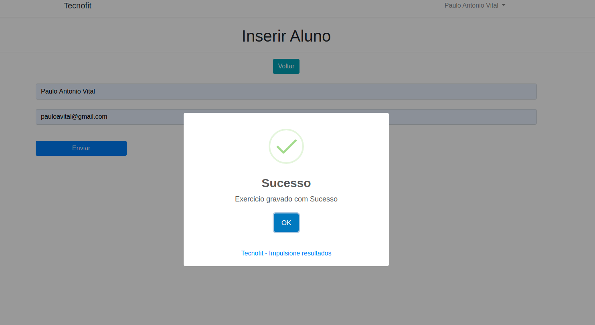

---

12. Cadastre os exercicios:
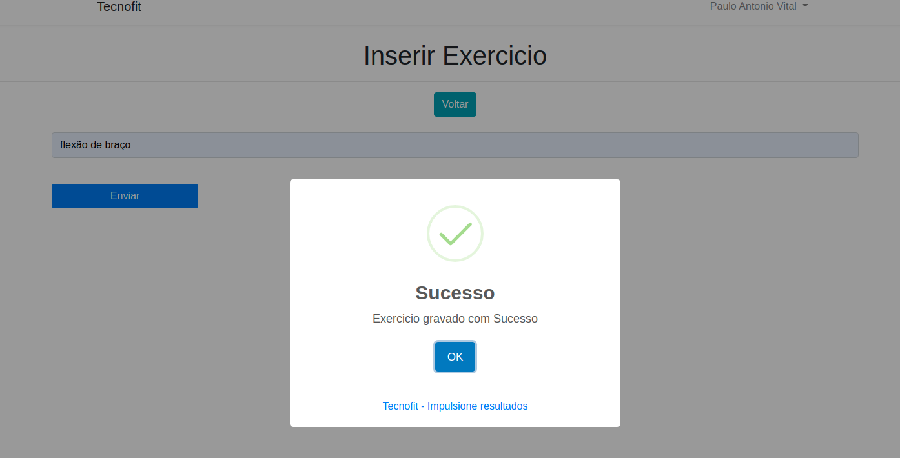

---

13. Cadastre os treinos:

---

13. Ativar/Pular/Finalizar:
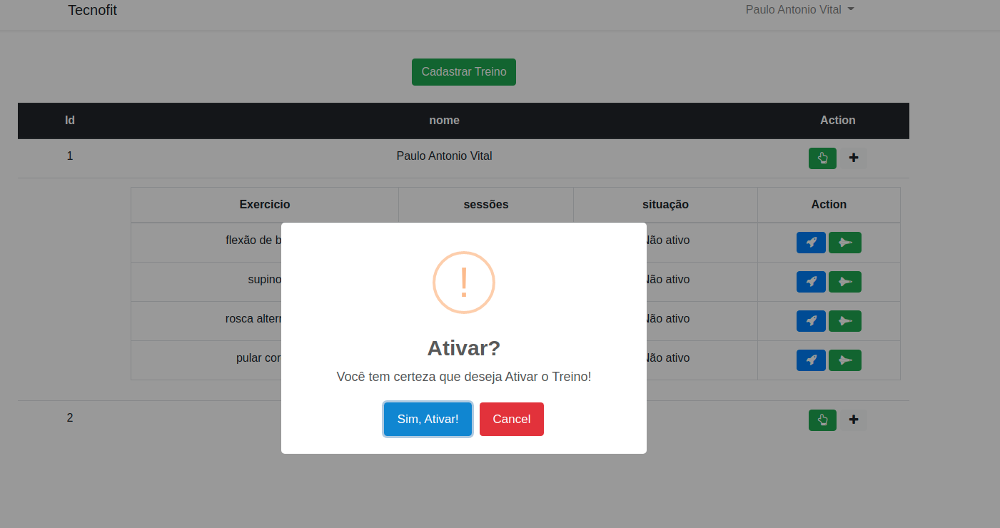

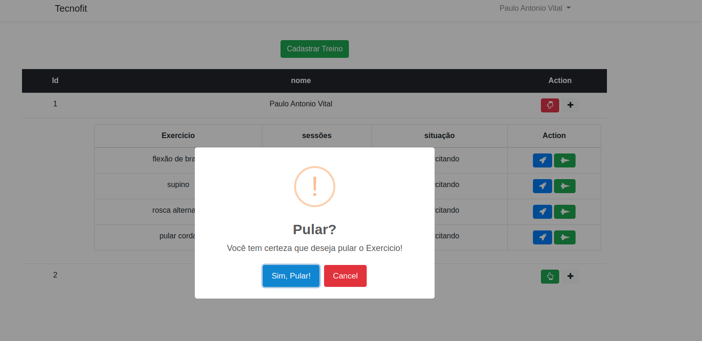

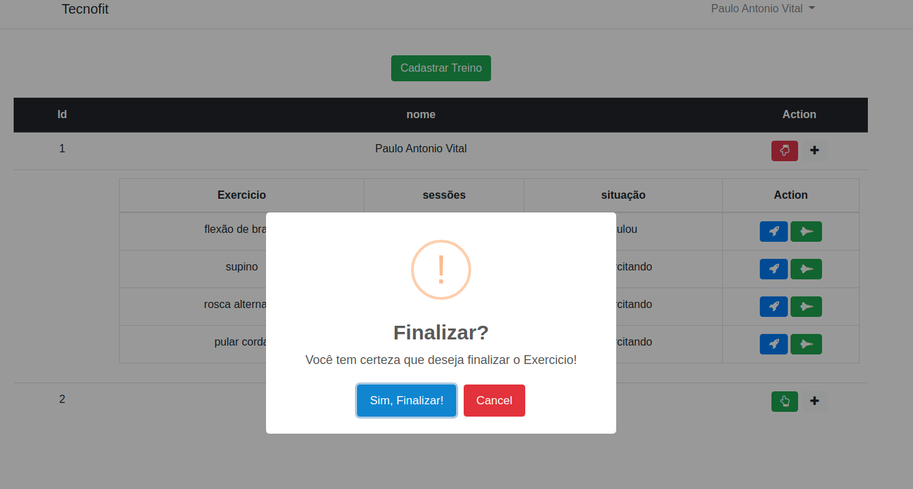

---

14. Ter o status do Aluno:
Entre no controle do aluno e selecione visualizar o (olho)

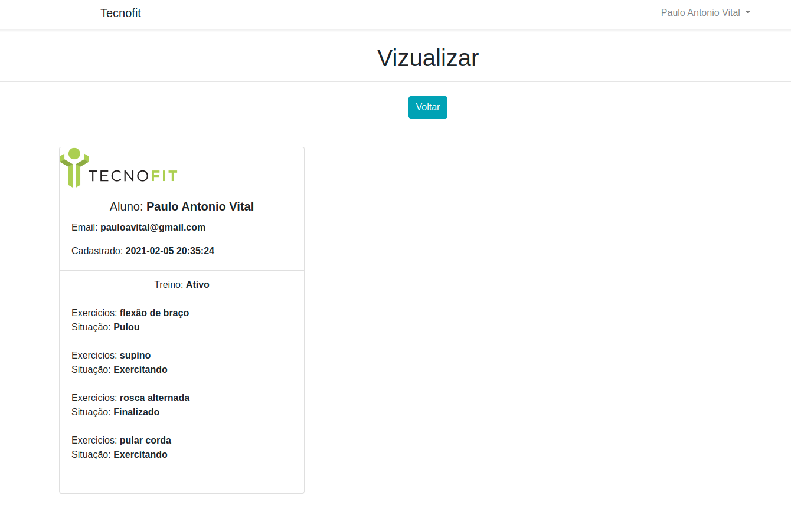

## License
The MIT License (MIT). Please see [License File](LICENSE) for more information.

## Desenvolvido por: Paulo Antonio Vital
  
